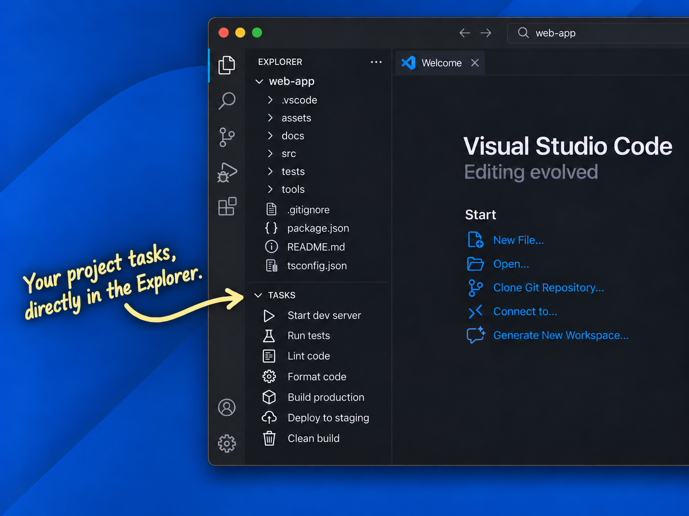

# Explorer Tasks

This extension provides a convenient way to view and run tasks defined in `.vscode/tasks.json` directly from the Explorer tab in VS Code. **Your tasks are now just a click away!**



Features:
- Show tasks defined in `tasks.json` in their original order.
- Run and stop tasks with a single click.
- Hide individual tasks or reveal hidden tasks.
- Group tasks using ` / ` in their labels.
- Customize task icons and colors.
- Create a starter `tasks.json` configuration when none exists.
- Add a ready-to-edit task from the Tasks panel.

See the [VS Code Tasks guide](https://code.visualstudio.com/docs/editor/tasks) for more information about tasks and their configuration.

## Task controls

- Click an idle task to run it.
- Click the Stop action to terminate a running task.
- Click the Edit action to open its definition in `tasks.json`.
- Click the Hide/Unhide action to hide or reveal a task in the view.

### Important notes

1. Task labels must be **unique within each workspace scope.** A task with a duplicated label is disabled until it is renamed.

2. If a running task is renamed or removed, its original label remains visible with a Stop action until the execution ends.

3. The Hide action adds `"hide": true` to the task definition in `tasks.json`, while the Unhide action removes it. You can hide or unhide tasks by editing `tasks.json` directly.


## Toolbar actions

- Create a new `.vscode/tasks.json` file if none exists.
- Add a shell task with a unique label and a placeholder command.
- Reload the task list manually.
- Switch between Flat View and Tree View when groups exist.
- Expand or Collapse groups in Tree View.
- Show hidden tasks if any exist.

Flat/Tree and Expand/Collapse settings are saved per workspace in `.vscode/settings.json`.

## Organize tasks into groups

- Separate parts of a task label with ` / ` to create folders. 
- Use multiple ` / ` separators to create nested folders.
- Groups appear where their first task occurs, and tasks within each group preserve their order from `tasks.json`.
- Labels without ` / ` remain at the root. 
- Ordinary slashes and colons are treated as part of the label.

**Important:** Use the complete label when referencing a task in `dependsOn` or `preLaunchTask`.

```json
{
  "version": "2.0.0",
  "tasks": [
    {
      "label": "Test",
      "type": "shell",
      "command": "npm test"
    },
    {
      "label": "Build / Development",
      "type": "shell",
      "command": "npm run build"
    },
    {
      "label": "Build / Production",
      "type": "shell",
      "command": "npm run build:production"
    }
  ]
}
```

## Task icons

- Tasks use a neutral gear icon by default. 
- Add an `icon` object to a task to use any valid [Codicon ID](https://microsoft.github.io/vscode-codicons/dist/codicon.html).
- Optionally set a [theme color](https://code.visualstudio.com/api/references/theme-color) for the icon.
- While a task is running, a running indicator temporarily replaces its configured icon.

```json
{
  "label": "Build",
  "type": "shell",
  "command": "npm run build",
  "icon": {
    "id": "package",
    "color": "charts.blue"
  }
}
```

Useful theme colors for task icons include:

```json
"color": "charts.blue"
"color": "charts.green"
"color": "charts.yellow"
"color": "charts.orange"
"color": "charts.red"
"color": "charts.purple"
"color": "charts.foreground"

"color": "terminal.ansiBlue"
"color": "terminal.ansiGreen"
"color": "terminal.ansiYellow"
"color": "terminal.ansiRed"
"color": "terminal.ansiMagenta"
"color": "terminal.ansiCyan"
"color": "terminal.ansiWhite"
```
